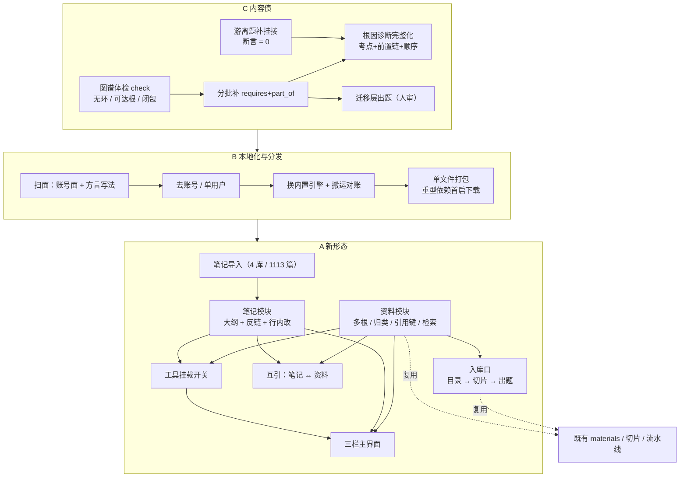

## 产品概述

把 QuizForge 从「刷题 + 到期复习」推进为**本地优先的认知引擎**：一台只跑在自己机器上、由对话调度、把「资料 / 笔记 / 出题 / 图谱」四件东西真正连成一条学习闭环的工作台。三块工作按 C → B → A 的顺序落地。

## 核心功能

**C · 让它真的会教（先做）**

- 图谱体检可执行：无环、任一概念可达根、无自环与双向语义边、传递闭包不矛盾
- 补有序关系（前置 / 组成），从当前很稀的状态补到「路径推荐不会断在半路」
- 把游离在概念之外的题补上挂接，并把「游离题为零」固化成断言
- 根因诊断做完整：错题 → 考点 → 前置链 → 先补哪个、几步，并接进错题本
- 迁移层出题（现在一道都没有）：少而精、必须挂概念、必须请人过目

**B · 本地化与分发**

- 去掉注册 / 登录 / 会话与按用户隔离，双击启动即可用
- 数据引擎随应用分发，不再依赖外部服务；开发与运行同一套
- 打成单文件应用：内置本地服务与前端产物；**重型运行组件不进安装包，首次打开时下载**到本地缓存，之后离线可用
- 备份从「服务端导出」变成「单文件快照」，一键备份与恢复

**A · 前端新形态**

- 三栏主界面：左资料树 / 中对话流 / 右笔记与图谱，切换不打断心流
- **笔记模块**：接管已有的 4 个笔记库（1113 篇，其中 362 篇带元数据头、335 篇有双链，其余是纯文本），提供大纲视图（层级缩进、折叠、行内编辑）与反向链接视图、全文检索；未解析的链接、缺失的元数据要有提示与补齐路径；由 AI 修改时按「行内插入/替换」落笔，可对比可撤销
- **资料模块**：多根目录（默认 15 个学科的资料目录，也可添加散落各处的资料，例如不在其中但同属资料的网页文档）；一个条目可带多个附件；元数据先尽力推断、再允许人工补，**需要语义判断的环节接入模型做归类**（论文 / 手册 / 网页文档 / 博客 / 代码目录等）与主题标签；全文检索；稳定引用键，可导出标准引用
- **两边打通**：笔记里引用一份资料（写出它的引用键即可），资料页面反过来列出「哪几篇笔记引了我」
- **资料即入库口**：在资料树里选中一个学科目录，就能把它送进既有流水线（切片 → 抽点 → 建概念 → 出题），新学科由此接入
- **工具挂载开关**：顶栏几个图标控制 AI 能调用哪些模块（资料 / 笔记 / 出题 / 图谱），亮起即调用、熄灭即独立；全部熄灭即极简模式（等同普通聊天）
- **界面节奏**：本轮只求「能用、顺手」，视觉规范统一放到最后，不在此版打磨

## 视觉

延续既有的克制风格与既有色板，不新造配色；新增的三栏与列表靠留白与分隔表达结构，不做装饰性图形与多余弹层。

## 技术栈

- **前端**：沿用仓库现有的原生 HTML / CSS / JS 与 `theme/runtime/*.js` 运行时，不引框架、不引 CDN（c.md 第 26、18 条，也是仓库既有铁律）
- **后端**：沿用 FastAPI + SQLAlchemy + Alembic（`api/app/`）；模型层已为可移植做了准备（`JSONType = JSON().with_variant(JSONB(), "postgresql")`、`db.py` 按方言建引擎、`config.is_postgres`）
- **新模块的存储**：`MD + YAML` 文件为**权威**（笔记 / 资料条目 / 引用关系索引）；题库、掌握度、作答记录仍以数据库为权威（用户已确认）
- **检索**：本地全文索引（可重建的派生产物，不引入外部服务）；912 概念规模的前置链用一次 BFS / 递归查询 + 请求内缓存即可，不引图库、不引向量库（延续既有取舍）
- **分发**：单文件应用 + 内置本地服务；重型运行组件（Python 运行时与预置包）首启下载进本地缓存并校验哈希

## 实现方案

### C 段：内容债

1. **先体检后补边**。给 `pipeline/graph_build.py` 加 `check` 子命令，把 cc.md 的验收条件变成可执行断言（无环、任一概念可达根、无自环、无双向语义边、传递闭包不矛盾），并入现有 `stats`。
2. **分批补有序边**。判边能力已在（`relate_pairs(limit, min_weight)`，只喂 `weight >= min_weight` 的共现对，写入带 `why` 的类型边）。本段做批量推进：按 `weight` 分档、按主题分批、幂等可续跑，每批后跑一次 `check`。**顺序边只认模型判的或人工确认的**，机械派生的易混边不参与路径计算（cc.md 已指出其精度偏松）。
3. **题-概念挂接**。事实层 `question_points`、统计口径 `question_concepts`。游离题优先用确定性派生补（题上已有的 `topic` / `pointKey` → 点 → 概念），剩下的带出处让模型判一次；补完在 `pipeline/coverage.py` 加硬断言「游离题 = 0」。
4. **路径与诊断**。`/graph/diagnose` 从雏形补成「考点 + 前置链 + 建议顺序 + 步数」，接进错题本页。
5. **迁移层出题**。走既有流水线与层 skill，手写题走 handmade skill；产出必须挂概念、必须带分支点、必须点名请人过目。

### B 段：本地化与分发

1. **扫面先行**（`[subagent:code-explorer]`）：列全账号面（`routers/auth.py`、`deps.py` 的守卫、每个路由的 `user_id` 过滤、带归属列的表、前端登录跳转）与所有 Postgres 专用写法（`pg_insert`、jsonb 原生 SQL、咨询锁），产出按文件分组的改动清单，改完当核对表用。
2. **去账号**：删守卫与逐用户过滤，改为单用户上下文；`user_settings` 退化成单行设置表（挂载开关等仍要落盘）；前端去掉登录页与跳转，启动直进。
3. **换内置引擎**：清理四处方言专属写法 —— `pipeline/dbstore.py` 的编号分配咨询锁改为立即事务 + 唯一索引重试；`api/app/sync_ops.py` 的 upsert 与「JSONB 按路径原子自增」改为读改写 + 行级锁（单用户，竞争面极小）；`api/app/outline.py` 的原生 jsonb 包含查询改为应用层过滤；`api/app/ai_gateway.py` 的 upsert。
4. **数据搬运与对账**：一次性搬运脚本，逐项核对（表行数 + 关键计数：已发布题数、概念数、边数、作答记录数）；随后快照命令改为单文件备份。
5. **打包**：单文件应用（内置服务 + 前端产物 + 运行时数据目录）；重型组件首启下载到缓存并校验哈希 —— 这是对 c.md 第 17/18 条张力的显式取舍：**仓库里自包含**（开发与离线开发可用），**分发包保持小体积**。

### A 段：新形态

**A1 笔记导入（一次性的数据工程，先做）**

- 源：`/mnt/f/Vaults`（Windows `F:\Vaults`）下**四个独立库** `Math` / `Personal` / `Philosophy` / `Tech`，各带 `.obsidian/`
- 实测：1113 篇 `.md`、362 篇带 YAML 头、335 篇有 `[[双链]]`，附件 424 png + 189 pdf，另有 css/js/json/html/svg/woff 与 `.canvas` / `.base`
- 策略：**非破坏 + 幂等 + 可核对**。保留原有相对路径与文件名导入到应用数据目录；`[[双链]]` 按文件名解析（与 Obsidian 语义一致）；缺失的元数据头**补最小头并标注为生成**（可逆）；`.obsidian` / `.canvas` / `.base` 不导入语义、**也不删除**，只记入导入清单的「跳过」一节；附件按**被引用**的搬入，未被引用的只列清单、由用户决定
- 产出：导入清单（新增 / 跳过 / 冲突 / 未引用附件）+ 可重复执行（第二次跑不产生副本）

**A2 笔记模块（对标 Obsidian + 幕布）**

- 结构（Obsidian 侧）：一份 Markdown 一个主题、YAML 头承载标题/标签、`[[双链]]`、反向链接列表、未解析链接提示
- 大纲（幕布侧）：层级缩进 + 折叠 + 行内编辑（回车同级、缩进即子级），同一份数据两种渲染
- 全文检索 + 反向链接索引（本地可重建索引）
- AI 写入按**行级插入/替换**，改动处留细标记，可对比可撤销；对「没有元数据、没有链接」的大多数笔记，提供**由模型批量建议标签与链接**的入口（一次任务、可逐条接受）

**A3 资料模块（对标 Zotero）**

- **多根**：默认根指向 15 个学科的资料目录（`reference` 是软链，实物在 `F:\Documents`），可添加任意其它目录（含散落的网页文档与代码目录）
- **条目粒度定死一种**：**一个源文件 = 一个条目**；多文件手册与成套文档用「集合」把它们归到一起 —— 这样引用键、全文检索、挂载进对话三件事的粒度一致，不会出现「一个条目里有一半内容」的模糊态
- **元数据**：先推断（文件名里的 arXiv 号 / 标题 / 年份，PDF 首页文本用既有抽取能力），再让模型判**类型与主题归类**（论文 / 手册 / 网页文档 / 博客 / 报告 / 代码目录），推断不出的在界面上手工补；落成本地元数据文件
- **引用键**：`首作者年份短标题`，取不到则回退为路径哈希（`doc-<hash8>`）；冲突加后缀；可导出标准引用（LaTeX 用户要能拿到 BibTeX）
- **全文检索**：复用 `attachments.py` 的抽取能力做本地文本缓存 + 索引
- **入库口**：选中一个学科目录 → 调既有 `pipeline.ingest` + 派工 → 在界面上看到覆盖率与出题进展（这就是 cc.md 候选二「不只一个学科」的落地方式）

**A4 两边打通**

- 笔记里写引用键即视为引用该资料；资料页列出「引用它的笔记」
- 共用一份 ID 映射文件，不引入外部库

**A5 工具挂载开关**

- `api/app/tools.py` 的 `REGISTRY` 加一层分组标记（资料 / 笔记 / 出题 / 图谱 / 沙箱），在三处按挂载集过滤：`specs()`（只声明已挂载的）、`call()`（未挂载直接返回错误，纵深防御）、`agent_loop.run(tools=...)` 的调用点
- 新增的资料/笔记工具一并纳入分组（如「在笔记里找」「把这段写进某篇笔记」「把某份资料挂进本次对话」）
- **空集即极简模式**：模型拿不到任何工具，等同普通聊天

**A6 三栏主界面**

- 把 chat 页升格为三栏主界面（它是唯一调度枢纽）；左栏资料树、中栏对话流、右栏笔记与图谱两态切换（图谱复用现有实现）；答题与错题本仍作专门视图保留
- 本轮**功能优先**：能开、能挂载、能读能写、能送流水线；视觉统一另排

## 实现要点（执行注意）

- **权威边界**：题库 / 掌握度 / 记录仍在数据库；笔记与资料以文件为权威。C 段的挂接与判边都写库、可对账、可复现
- **导入的非破坏性**：源目录不动；导入可重复执行；清单可核对；补出来的元数据头要标注为生成，能识别出「这是机器补的」
- **性能**：资料库扫描与 PDF 抽取是唯一的重 IO，分批 + 缓存文本，避免每次打开都重扫；前置链查询规模小（912 概念），不做图库与向量库
- **可靠性红线**：`make api-test`（183 项）与 `make test`（3170 断言 + `node --check` 语法门禁）全程保持绿；UI 改动必须有浏览器实测数值或截图证据
- **零碎账**：顺手带上卡片来源标记、用一道用户题跑通「作答 → 判分 → 记录」、组卷题源在浏览器验一次、两条时好时坏的用例、`docs/STATUS.md` 改准
- **提交**：中文、要短、一次一件事；改完题库必须 `python3 tools/check.py` 到 0 error

## 架构设计



## 目录结构（要点）

```
api/app/
  notes.py                [NEW] 笔记库：导入清单、元数据头补齐、双链与反链解析、行级写入
  library.py              [NEW] 资料库：多根扫描、条目元数据（推断 + 模型归类 + 手工补）、引用键、文本缓存与检索、引用关系
  routers/notes.py        [NEW] 笔记的 HTTP 面（列 / 搜 / 读 / 行级改 / 建议标签与链接）
  routers/library.py      [NEW] 资料的 HTTP 面（列 / 搜 / 读 / 补元数据 / 挂载 / 送入流水线）
  routers/__init__.py     [MODIFY] 登记新路由
  routers/auth.py         [DELETE] B 段：注册 / 登录 / 退出 / 改密
  deps.py                 [MODIFY] B 段：删 CurrentUser / AuthenticatedWriter / CSRF 守卫
  routers/*.py            [MODIFY] B 段：逐处去掉按用户过滤；chat 加读取挂载集
  models.py               [MODIFY] B 段：users / sessions 退役，user_settings 降为单行设置
  sync_ops.py             [MODIFY] B 段：去 upsert 与 JSONB 原子自增
  outline.py              [MODIFY] B 段：去 jsonb 原生 SQL
  ai_gateway.py           [MODIFY] B 段：去 upsert
  tools.py                [MODIFY] REGISTRY 分组；新增笔记/资料工具；specs() 与 call() 按挂载集过滤
  agent_loop.py           [MODIFY] 只声明已挂载的工具
theme/
  pages/study.body.html   [NEW] 三栏主界面（或由 chat 页升格）
  runtime/notes.js        [NEW] 大纲 / 反链 / 行内编辑 / 检索
  runtime/library.js      [NEW] 资料树 / 条目页 / 挂载 / 送流水线
  runtime/chat.js         [MODIFY] 顶栏枢纽图标、右栏两态切换、挂载状态、新工具的事件
  chat.css / app.css      [MODIFY] 三栏与列表样式（沿用既有设计令牌）
  login.html / landing.html [DELETE] B 段：登录与着陆
pipeline/
  graph_build.py          [MODIFY] 加 check（无环 / 可达根 / 闭包）并入 stats；补边批量推进参数
  coverage.py             [MODIFY] 加「游离题 = 0」断言；概念口径对账
  dbstore.py              [MODIFY] 编号分配去咨询锁
  ingest.py / dispatch.py [MODIFY] 接受资料库条目作为材料来源
tools/
  import_vault.py         [NEW] 导入四个笔记库（幂等、可核对、源目录不动）
  library_scan.py         [NEW] 扫描多根目录，产出条目清单与去重
  backfill_process.py     [EXISTS] 已有，保留
build/
  package.py              [NEW] 单文件打包 + 首启下载与哈希校验
docs/
  STATUS.md               [MODIFY] 按实测改准
data/（应用数据目录，不进仓库）
  notes/                  [NEW] 导入后的笔记（保留原相对路径）
  library/<citekey>.yaml  [NEW] 资料条目元数据
  library/.text/          [NEW] 抽取的全文缓存（可重建）
  library/.index          [NEW] 检索与反链索引（可重建）
```

## 关键数据结构（新模块的文件契约）

资料条目元数据文件（`library/<citekey>.yaml`）—— 多模块依赖，需定死：

```
citekey: trefethen1997numerical     # 稳定 ID：首作者+年份+短标题；取不到则 doc-<hash8>
title: Numerical Linear Algebra
authors: [Trefethen, Bau]
year: 1997
kind: book                          # paper | book | manual | report | webpage | blog | slides | code | other
topics: [math, 数值线性代数]         # 模型归类 + 人工可改
source: /mnt/f/Documents/math/Trefethen-Bau.pdf   # 多根下的真实路径
files: [{path: <同上>, role: primary}]            # 一个条目可带多个文件
origin: inferred | llm | manual     # 元数据是怎么来的（可回溯、可重跑）
```

引用关系：笔记正文里出现 `[[@citekey]]` 或 `@citekey` 即建立一条边；反链索引从笔记批量扫出来（派生，可重建）。

## 设计定位

延续既有的克制风格与**既有设计令牌**，不新造配色、不引任何框架与 CDN。本轮新增的只是「三栏工作台」的骨架与笔记/资料的列表形态，**以能用、顺手为准，视觉统一留到最后一轮**（用户明确说不急）。

## 三栏工作台（升格现有 chat 页）

- **顶栏**：左侧品牌图标（与 `shell.html` 现有那枚同源），中部枢纽图标组（资料 / 笔记 / 出题 / 图谱），亮起即挂载、熄灭即独立，全部熄灭即极简模式；右侧设置与主题。图标为细描边、统一笔画粗细
- **左栏 · 资料树**：极简文件树与条目列表，层级用缩进与次级文字色表达；选中即预览摘要，一键「挂载到当前对话」；资料只读，界面不提供编辑入口
- **中栏 · 对话流**：沿用现有消息区与零件化渲染（正文、过程折叠、题卡、引用、演示、执行），消息间距与卡片同源
- **右栏 · 笔记 / 图谱**：顶部两态切换（结构 / 连接）；结构是笔记大纲与反链列表，连接复用现有力导向图；切换不重排中栏

## 笔记与资料

- **笔记大纲**：层级缩进 + 折叠箭头 + 行内编辑（原地改，不弹窗）；反链区列出「谁引用了我」，未解析链接单独提示并可一键补齐
- **资料条目**：一行一个条目（标题 / 作者年份 / 类型标签 / 引用键），元数据缺失处给出「待补」标记，点开即补；类型标签用同一套色阶区分论文、手册、网页文档
- **引用键**：界面可一键复制，粘贴进笔记即建立引用

## 动效与响应式

- 挂载开关切换：图标描边到实心 + 轻微缩放（120–160ms，`ease-out`），不弹提示条
- 三栏与右栏切换：只有透明度与位移的短过渡，不改变布局尺寸
- 桌面为主：三栏可拖拽（左 240 / 右 320 起）；窄屏（<1180px）折叠为「对话 + 侧栏抽屉」，侧栏用浮层而不挤压对话宽度

## Agent Extensions

### SubAgent

- **code-explorer**
- Purpose: B 段开工前做一次完整扫面 —— 列全账号/多租户的调用面（`routers/auth.py`、`deps.py` 的守卫、每个路由里的按用户过滤、带归属列的表、前端登录跳转）与所有 Postgres 专用写法（upsert、jsonb 原生 SQL、咨询锁）
- Expected outcome: 一份按文件分组的改动清单，使去账号与换引擎两件事不靠猜、不漏改，并在改完后作为核对表使用

### Skill

- **quizforge-pipeline**
- Purpose: C 段补有序边与补题挂接走既有流水线规程（判边命令、派工、覆盖率对账、失败题归宿），不另起一套
- Expected outcome: 分批判边与挂接可幂等续跑，覆盖率与「游离题 = 0」有可复现的对账输出
- **quizforge-l4-transfer**
- Purpose: 出迁移层题（当前 0 道），按该层判定表与「迁移锚点 + 变式手法」的强制要求产出
- Expected outcome: 一批通过该层判定表、带分支点、挂上概念的迁移层题，并明确标出需人审的部分
- **quizforge-handmade**
- Purpose: 用户手写的迁移层/法式大题接入题库与图谱，保证不进图谱盲区
- Expected outcome: 手写题格式合规、元数据补全、可解析出关系边、入库并参与覆盖对账
- **pdf**
- Purpose: 资料库的文本抽取与元数据取材（PDF 首页/前几页取标题作者年份），遇到扫描件做 OCR，多文件手册按页范围提取
- Expected outcome: 每个 PDF 条目都拿到可检索的全文缓存与一份可推断的元数据初稿，扫描件也能进检索
- **playwright-cli**
- Purpose: A 段三栏界面、笔记大纲/反链、资料树与挂载开关的逐条浏览器实测（量数值、截图对比），沿用「UI 改动必须有实测证据」的惯例
- Expected outcome: 每处改动都有改动前后的实测数值或截图，不留「看起来对」的改动