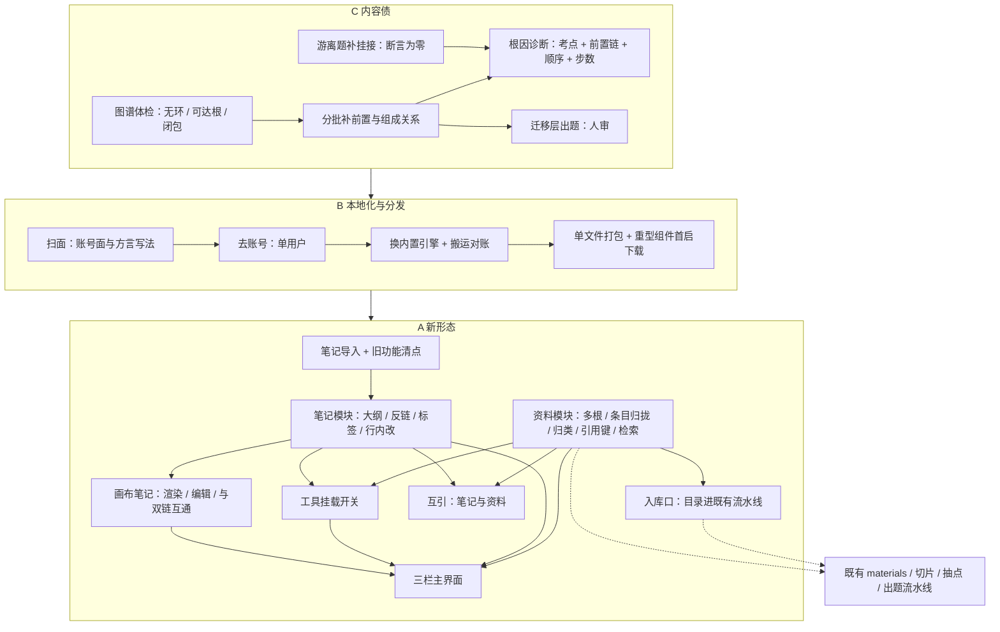

## 产品概述

把 QuizForge 从「刷题 + 到期复习」推进为本地优先的认知引擎：一台只跑在自己机器上、由对话调度，把资料、笔记、出题、图谱连成一条学习闭环的工作台。整体按内容债、本地化与分发、新形态三块依次落地；这一版界面只求能用顺手，视觉统一放到最后。

## 核心功能

- 让它真的会教：图谱可体检（无环、任一概念都能走到根、不出现断头路）；补齐前置与组成关系；把游离在概念之外的题全部补上挂接，并把「没有游离题」固化成长期断言；错题给出根因诊断（考点、前置链、先补哪个、几步）并呈现在错题本上；补出迁移层题目（少而精、必须人工过目）。
- 本地化与分发：去掉注册登录与会话、不再区分用户，双击即用；数据引擎随应用一起分发，开发与运行同一套；打包成单文件应用，重型运行组件在首次打开时下载到本机缓存、之后离线可用；备份变成单文件快照，可一键备份与恢复。
- 新形态：
- 三栏主界面：左资料、中对话、右笔记与图谱，切换不打断心流。
- 笔记模块：接管已有四个笔记库（1113 篇，其中多数没有标签也没有链接，要能吃下这种常态并给出补齐路径）；原生支持画布笔记（画布上的卡片、分组与连线，能读能改，卡片指向某篇笔记时与双链互通）；按清点结果原生复刻原先常用的笔记行为，含改名时自动更新引用它的链接、属性编辑、模板、日记、文件恢复与撤销。
- 资料模块：管理多个资料目录；一个条目就是一个文件连同它引用的图片等附属资源；元数据先尽力推断、推断不出的手工补、需要理解的地方交给模型归类；条目带稳定引用键与全文检索。
- 两边打通：笔记里引用一份资料，资料那边列出哪几篇笔记引了它。
- 资料即入库口：选中一个学科目录就能送进既有的切片到出题流水线，界面上看到覆盖率与进展。
- 工具挂载开关：顶栏几个图标控制 AI 能调用哪些模块，亮起即调用、全部熄灭即极简聊天模式。

## 视觉

延续既有克制风格与色板，不新造配色；三栏、列表与画布靠留白与分隔表达结构，不做装饰性图形与多余弹层。

## 技术栈

- 前端：沿用仓库既有的原生 HTML / CSS / JS 与 `theme/runtime/*.js`，不引框架、不引 CDN（c.md 第 26 / 18 条，仓库铁律）；**新增脚本必须登记进 `tools/build_web.py` 的 `RUNTIME_ORDER`**（顺序决定加载，漏登记会直接报错）。
- 后端：沿用 FastAPI + SQLAlchemy + Alembic（`api/app/`）。模型层已为可移植做了准备：`JSONType = JSON().with_variant(JSONB(), "postgresql")`、`db.py` 按方言建引擎、`config.is_postgres`。**新表必须出迁移**（当前 head `a7c41d9e2b30`）。
- 存储权威：笔记 / 资料 / 索引以 **MD + YAML 文件**为权威，落在应用数据目录；题库、掌握度、作答记录**仍以数据库为权威**（用户已确认）。挂载开关与资料根目录清单落 `user_settings`（B 段后降为单行设置表，需要迁移）。
- 检索：本地可重建索引（派生产物），不引外部服务；前置链在 912 概念规模用一次 BFS / 递归查询 + 请求内缓存，不引图库与向量库。
- 分发：单文件应用 + 内置本地服务；重型运行组件（Python 运行时与预置包）首启下载进本地缓存并校验哈希。

## 实现方案

### C 段：内容债（先做）

1. **先体检后补边**：给 `pipeline/graph_build.py` 加 `check` 子命令，把验收条件变成可执行断言（无环、任一概念可达根、无自环、无双向语义边、传递闭包不矛盾），并入现有 `stats`。
2. **分批补有序边**：判边能力已在（`relate_pairs(limit, min_weight)`，只喂 `weight >= min_weight` 的共现对，写入带 `why` 的类型边）。本段做批量推进：按 `weight` 分档、按主题分批、**幂等可续跑**，每批之后跑一次 `check`。顺序边只认模型判的或人工确认的，机械派生的易混边不参与路径计算。
3. **题-概念挂接**：事实层 `question_points`、统计口径 `question_concepts`。游离题优先用确定性派生补（题上已有的 `topic` / `pointKey` → 点 → 概念），剩下的带出处让模型判一次；补完在 `pipeline/coverage.py` 加硬断言「游离题为零」。
4. **路径与诊断**：`/graph/diagnose` 从雏形补成「考点 + 前置链 + 建议顺序 + 步数」，接进错题本页。
5. **迁移层出题**：走既有流水线与层规程；产出必须挂概念、必须带分支点、必须点名请人过目。

### B 段：本地化与分发

1. **扫面先行**：列全账号面（`routers/auth.py`、`deps.py` 的守卫、每个路由的按用户过滤、带归属列的表、前端登录跳转）与所有 Postgres 专用写法（upsert、jsonb 原生 SQL、咨询锁），产出按文件分组的改动清单，改完当核对表用。
2. **去账号**：删守卫与逐用户过滤，改为单用户上下文；`user_settings` 退化成单行设置表；前端去掉登录页与跳转，启动直进。
3. **换内置引擎**：四处方言专属写法 —— `pipeline/dbstore.py` 的编号分配咨询锁改为立即事务 + 唯一索引重试；`sync_ops.py` 的 upsert 与「JSONB 按路径原子自增」改为读改写 + 行级锁（单用户，竞争面极小）；`outline.py` 的原生 jsonb 包含查询改为应用层过滤；`ai_gateway.py` 的 upsert。
4. **搬运与对账**：一次性搬运脚本，逐项核对（表行数 + 关键计数：已发布题数、概念数、边数、作答记录数）；随后快照命令改为单文件备份。
5. **打包**：单文件应用（内置服务 + 前端产物 + 运行时数据目录）；重型组件首启下载到缓存并校验哈希 —— 仓库里 `vendor/` 自包含（开发与离线开发可用），分发包保持小体积。

### A 段：新形态

**A0 笔记导入（一次性数据工程，先做）**

- 源为 `F:\Vaults`（开发环境可见于 `/mnt/f/Vaults`）下**四个独立库** `Math` / `Personal` / `Philosophy` / `Tech`。实测：**1113 篇 `.md`**，其中 **362 篇有 YAML 头**、**335 篇用过双链**，其余是纯 markdown；附件 424 png、189 pdf，另有 css / js / json / html / svg / woff；**7 个 `.canvas`**（最大的约 46KB，`Math/Untitled.canvas` 是空对象，要容错）、**1 个 `.base`**。
- 策略：**非破坏 + 幂等 + 可核对**。保留原有相对路径与文件名导入到 `data/notes/`；双链按文件名解析（与既有语义一致）；缺失的元数据头**补最小头并标注为机器生成**（可逆、可识别）；**`.canvas` 原样导入并作为一等条目**；`.obsidian` / `.base` 不导入语义也不删除，记入清单「跳过」一节；附件按**被引用**搬入，未引用的只列清单由用户定。
- 产出：导入清单（新增 / 跳过 / 冲突 / 未引用附件），第二次执行不产生副本。

**A1 旧功能清点与原生复刻**

- 实测依据：四个库里**只有 `Math` 留了完整配置**（`app.json` / `appearance.json` / `core-plugins.json` / `graph.json` / `workspace.json`），另三个只有 `app.json`；**没有任何社区插件**（无 `plugins/` 目录）→ 不需要插件兼容层，只需复刻核心功能那一层。
- `Math` 的启用清单即为「用户实际用过的功能」：文件树、全局搜索、快速切换、图谱、反链、Canvas、出链、标签、属性、页面预览、日记、模板、笔记合成、命令面板、编辑器状态、书签、大纲、字数统计、文件恢复、同步、Bases。四个库的 `app.json` 都是 `alwaysUpdateLinks: true`。
- 产出 `docs/笔记功能对照.md`：逐条写明「原生实现 / 暂不做 / 不适用」。建议原生实现：文件树、全文搜索、快速切换、反链与出链、标签面板、**属性编辑（YAML 元数据）**、大纲、书签、日记、模板、**文件恢复（改动前快照，可撤销）**、**Canvas**、**改名自动更新入链**；暂不做：Bases、slides、audio-recorder、webviewer、publish、sync（本地单用户不需要）。

**A2 笔记模块（对标 Obsidian + 幕布）**

- 结构侧：一份 Markdown 一个主题、YAML 头承载标题与标签、双链、反向链接列表、未解析链接提示与一键补齐。
- 大纲侧：层级缩进 + 折叠 + 行内编辑（回车同级、缩进即子级），同一份数据两种渲染。
- 全文检索与反链索引本地可重建；AI 写入按**行级插入 / 替换**，改动处留细标记，可对比可撤销（与「文件恢复」同源）；对「没有元数据、没有链接」的大多数笔记，提供**由模型批量建议标签与链接**的入口（一次任务、可逐条接受）。

**A3 Canvas 原生支持**

- 解析与写回 JSON Canvas：`nodes`（text / file / link / group）与 `edges`（方向、标签、颜色）。
- 渲染用 **DOM 节点**而非位图：可选中、可拖拽、可缩放、text 节点可原地编辑；规模极小（7 个文件、最大 46KB），全量解析无压力。
- **编辑深度定为「新建 / 移动 / 连线 / 删除 + 文本编辑」这一档**（再深的批量布局与自动排版不做）；canvas 里 `file` 节点指向某篇笔记时**计入链接图**（与反链打通）；canvas 作为笔记树里的一等条目，可新建。

**A4 资料模块（对标 Zotero）**

- **多根**：默认根指向 `F:\Documents`（开发环境 `reference` 是指向它的软链，实测 15 个学科目录、约 282MB、主要是 PDF，也混着 md / py），可添加任意目录（含散落的网页文档与代码目录）。
- **条目粒度已定死**：**一个条目 = 一个主文件 + 它引用的所有附属资源（图片等）** —— 按主文件内的引用关系自动归拢附属资源，不做多文件合并。这样引用键、全文检索、挂载进对话三件事的粒度一致。
- **元数据**：先推断（文件名里的 arXiv 号 / 标题 / 年份，PDF 首页文本复用既有抽取能力），再让模型判**类型与主题归类**（论文 / 手册 / 网页文档 / 博客 / 报告 / 代码目录），推断不出的界面手工补；落本地元数据文件，带 `origin` 可回溯（推断 / 模型 / 手工）。
- **引用键**：首作者 + 年份 + 短标题，取不到则 `doc-` 加 8 位哈希；冲突加后缀；可导出 BibTeX。
- **全文检索**：复用 `attachments.py` 的抽取做本地文本缓存 + 索引（可重建）。
- **入库口**：选中学科目录 → 走既有 `materials` / `point_sources` 那条切片抽点建概念出题流水线，界面显示覆盖率与出题进展（界面上做成「送去做题」一个动作 + 一个进度视图）。

**A5 两边打通**：笔记里写引用键（双链形式或 `@` 形式）即建立引用边；资料页列出「引用它的笔记」；共用一份 ID 映射文件，不引外部库。

**A6 工具挂载开关**：`tools.py` 的 `REGISTRY` 加分组标记（资料 / 笔记 / 图谱 / 出题 / 沙箱），在三处按挂载集过滤：`specs()`（只声明已挂载的）、`call()`（未挂载直接返回错误，纵深防御）、`agent_loop.run(tools=...)` 调用点；新增的笔记与资料工具一并纳入分组（如「在笔记里找」「把这段写进某篇笔记」「把某份资料挂进本次对话」）；**空集即极简模式**。

**A7 三栏主界面**：chat 页升格为三栏（它是唯一调度枢纽）；左资料树、中对话流、右笔记与图谱两态切换（图谱复用现有 `graph.js`）；答题与错题本仍作专门视图保留。本轮**功能优先**，视觉统一另排。

## 实现要点（执行注意）

- **权威边界**：题库 / 掌握度 / 记录仍在数据库；笔记与资料以文件为权威。C 段的挂接与判边都写库、可对账、可复现。
- **导入的非破坏性**：源目录不动；导入可重复执行（按源路径 + 内容哈希去重）；清单可核对；补出来的元数据头标注为机器生成。
- **改名更新入链**：先写内容后改文件名，失败可回滚，避免半途留下断链。
- **性能**：资料扫描与 PDF 抽取是唯一重 IO（约 282MB / 二百余文件），首次全量后台分批跑并缓存文本，之后按修改时间增量；笔记导入 1113 篇一次跑完即可；前置链查询规模小（912 概念）；canvas 只有 7 个小文件。
- **已知坑**：新增前端脚本必须登记 `RUNTIME_ORDER`；若用到弹窗必须走 `ui.js` 的 `modal` 约定（`#modal-root` 且带 `.modal-root` class）；顶栏品牌图标在 `shell.html` 与 `chat.js` 的 `logoMark()` **两处同源，要一起改**。
- **零碎账顺手清**：卡片来源标记、用一道用户题跑通「作答 → 判分 → 记录」、组卷题源在浏览器验一次、两条时好时坏的用例、`docs/STATUS.md` 改准。
- **红线**：`make api-test`（183 项）与 `make test`（3170 断言 + `node --check` 语法门禁）全程保持绿；UI 改动必须有浏览器实测数值或截图证据；出题流水线状态机（draft → verified → published，退役只下架不删除）与覆盖率口径不得破坏；改完题库必须 `tools/check.py` 到 0 error；提交信息中文且短，一次一件事。

## 架构设计



## 目录结构（要点）

```
api/app/
  notes.py                 [NEW] 笔记库核心：导入清单、YAML 最小头补齐、双链与反链解析、行级插入替换、改名更新入链
  canvas.py                [NEW] 画布解析与写回：节点 text/file/link/group 与边属性；指向笔记的节点计入链接图
  library.py               [NEW] 资料库核心：多根扫描、条目等于主文件加附属资源归拢、元数据推断、模型归类、引用键、文本缓存
  routers/notes.py         [NEW] 笔记与画布的 HTTP 面：树 / 读 / 行级改 / 搜索 / 标签 / 反链 / 快照撤销
  routers/library.py       [NEW] 资料 HTTP 面：根目录管理、条目列表、元数据补、挂载、引用键、被引笔记、送入流水线
  routers/__init__.py      [MODIFY] 登记新路由
  tools.py                 [MODIFY] REGISTRY 分组（资料 / 笔记 / 图谱 / 出题 / 沙箱）+ 新增笔记与资料工具；specs 与 call 按挂载集过滤
  agent_loop.py            [MODIFY] 只声明已挂载的工具
  attachments.py           [MODIFY] 抽出可复用的取文本入口，供资料全文检索与 PDF 首页取材
  models.py                [MODIFY] B 段：users / sessions 退役，user_settings 降为单行设置（挂载开关与资料根仍落盘）
  deps.py                  [MODIFY] B 段：删 CurrentUser / AuthenticatedWriter / CSRF 守卫
  routers/auth.py          [DELETE] B 段
  sync_ops.py / outline.py / ai_gateway.py  [MODIFY] B 段：去 upsert、去 jsonb 原生 SQL、去咨询锁
theme/
  runtime/notes.js         [NEW] 笔记：文件树、大纲 / 反链 / 出链 / 标签、行内编辑、搜索、快照撤销
  runtime/canvas.js        [NEW] 画布：渲染、拖拽缩放、节点编辑、连线、新建与删除
  runtime/library.js       [NEW] 资料树与条目页、元数据补、挂载、送入流水线、被引笔记
  runtime/chat.js          [MODIFY] 顶栏枢纽图标、右栏两态、挂载状态、新工具事件
  pages/study.body.html    [NEW] 三栏主界面（或由 chat 页升格，实现时二选一并说明理由）
  chat.css / app.css       [MODIFY] 三栏与列表样式（沿用既有令牌）
  login.html / landing.html [DELETE] B 段
tools/
  import_vault.py          [NEW] 导入四个笔记库：幂等、可核对、源目录不动、输出导入清单
  build_web.py             [MODIFY] RUNTIME_ORDER 登记新增脚本
pipeline/
  graph_build.py           [MODIFY] check 子命令 + 补边批量推进参数
  coverage.py              [MODIFY] 游离题为零断言 + 概念口径对账
  dbstore.py               [MODIFY] B 段：编号分配去咨询锁
build/
  package.py               [NEW] 单文件打包 + 首启下载与哈希校验
docs/
  笔记功能对照.md           [NEW] 旧配置清单逐条对照：原生实现 / 暂不做 / 不适用
  STATUS.md                [MODIFY] 按实测改准
data/（应用数据目录，不进仓库）
  notes/                   [NEW] 导入后的笔记，保留原相对路径；画布文件原样保留
  library/{citekey}.yaml   [NEW] 资料条目元数据（含 origin 可回溯）
  library/.text 与 .index  [NEW] 抽取文本缓存与检索 / 反链索引，均可重建
```

## 关键数据结构（新模块的文件契约）

资料条目元数据（`data/library/{citekey}.yaml`）—— 多模块依赖，需定死：

```
citekey: trefethen1997numerical
title: Numerical Linear Algebra
authors: [Trefethen, Bau]
year: 1997
kind: book              # paper | book | manual | report | webpage | blog | slides | code | other
topics: [math, 数值线性代数]
source: F:\Documents\math\Trefethen-Bau.pdf
files:
  - {path: 同上, role: primary}
  - {path: F:\Documents\math\figs\1-1.png, role: asset}   # 由主文件内的引用关系自动归拢
origin: inferred        # inferred | llm | manual
```

画布文件契约（JSON Canvas，与既有实现兼容，仅摘关键字段）：

```
{
  "nodes": [
    {"id": "n1", "type": "text", "x": 0, "y": 0, "width": 320, "height": 180, "text": "要点", "color": "4"},
    {"id": "n2", "type": "file", "x": 380, "y": 0, "width": 320, "height": 180, "file": "信号与系统/卷积.md"},
    {"id": "n3", "type": "group", "x": -40, "y": -40, "width": 800, "height": 300, "label": "分组"}
  ],
  "edges": [
    {"id": "e1", "fromNode": "n1", "toNode": "n2", "label": "推出", "color": "2"}
  ]
}
```

## 边界与取舍

- 旧笔记库已确认不再回原编辑器，因此**不做插件兼容层**，只复刻核心功能中值得做的部分（清单见对照文档）。
- 画布编辑停在「新建 / 移动 / 连线 / 删除 + 文本编辑」一档，不做自动排版与批量布局。
- 资料条目不做多文件合并；成套文档若要归到一起，用标签与目录表达，不新造「集合」概念。
- Bases、slides、audio-recorder、webviewer、publish、sync 明确不做（本地单用户无必要）。

## 设计定位

延续既有的克制风格与**既有设计令牌**，不新造配色、不引框架与 CDN。本轮新增的是「三栏工作台」的骨架、笔记与资料的列表形态、以及画布视图；按用户明确要求，**本版只求能用顺手，视觉规范统一留到最后一轮**，因此不做装饰性图形、不做多余弹层、不引入额外动效库。

## 应用类型与架构

桌面端 Web 应用，沿用仓库原生 HTML / CSS / JS 运行时不引框架；三栏由现有 chat 页升格，答题与错题本仍作为专门视图保留。

## 主界面：三栏工作台

- **顶栏**：左侧品牌图标（与既有顶栏同源），中部枢纽图标组（资料 / 笔记 / 图谱 / 出题），亮起即挂载、熄灭即独立、全部熄灭即极简模式；右侧设置与主题。细描边同源图标，统一笔画粗细。
- **左栏 · 资料树**：极简文件树与条目列表，层级用缩进与次级文字色表达；选中即预览摘要，一键挂载到当前对话；资料只读，不提供编辑入口。
- **中栏 · 对话流**：沿用现有零件化渲染（正文、过程折叠、题卡、引用、演示、执行），消息间距与卡片同源，过程块默认折叠为一行。
- **右栏 · 笔记与图谱**：顶部两态切换；结构是笔记大纲与反链列表，连接复用现有力导向图；切换不重排中栏。

## 笔记与画布视图

- **笔记大纲**：层级缩进加折叠箭头，行内编辑（原地改、不弹窗）；反链区列出「谁引用了我」，未解析链接单独提示并可一键补齐；属性（元数据）在标题下方一行内编辑。
- **画布**：无限平面网格，卡片为圆角矩形（文本卡、文件卡、链接卡、分组框）；选中出现细描边，拖拽即移动，连线从边中点拖出；文本卡双击原地编辑；缩放与网格跟随，不改变其它区域尺寸。
- **资料条目**：一行一个条目（标题、作者年份、类型标签、引用键）；元数据缺失处给「待补」标记，点开即补；类型标签用同一套色阶区分论文、手册、网页文档。

## 交互与响应式

- 挂载开关：图标由描边到实心加轻微缩放（120 至 160 毫秒，ease-out），不弹提示条。
- 三栏与右栏切换：仅透明度与位移的短过渡，不改变布局尺寸。
- 桌面为主：三栏可拖拽（左 240、右 320 起）；窄于 1180px 折叠为「对话加侧栏抽屉」，抽屉用浮层不挤压对话宽度。

## Agent Extensions

### SubAgent

- **code-explorer**
- Purpose: B 段开工前做一次完整扫面 —— 列全账号与多租户的调用面（`routers/auth.py`、`deps.py` 的守卫、每个路由的按用户过滤、带归属列的表、前端登录跳转）与所有 Postgres 专用写法（upsert、jsonb 原生 SQL、咨询锁）。
- Expected outcome: 一份按文件分组的改动清单，使去账号与换引擎两件事不靠猜、不漏改，并在改完后作为核对表使用。

### Skill

- **quizforge-pipeline**
- Purpose: C 段补有序边与补题挂接走既有流水线规程（判边命令、派工、覆盖率对账、失败题归宿），不另起一套。
- Expected outcome: 分批判边与挂接可幂等续跑，覆盖率与「游离题为零」有可复现的对账输出。
- **quizforge-l4-transfer**
- Purpose: 出迁移层题（当前一道都没有），按该层判定表与「迁移锚点加变式手法」的强制要求产出。
- Expected outcome: 一批通过该层判定表、带分支点、挂上概念的迁移层题，并明确标出需人审的部分。
- **quizforge-handmade**
- Purpose: 用户手写的迁移层与综合大题接入题库与图谱，保证不进图谱盲区。
- Expected outcome: 手写题格式合规、元数据补全、可解析出关系边、入库并参与覆盖对账。
- **pdf**
- Purpose: 资料库的文本抽取与元数据取材（PDF 首页取标题作者年份），遇扫描件做 OCR，多文件手册按页范围提取。
- Expected outcome: 每个 PDF 条目都拿到可检索的全文缓存与一份可推断的元数据初稿，扫描件也能进检索。
- **playwright-cli**
- Purpose: A 段三栏界面、笔记大纲与反链、画布编辑、资料树与挂载开关的逐条浏览器实测（量数值、截图对比）。
- Expected outcome: 每处改动都有改动前后的实测数值或截图，不留「看起来对」的改动。