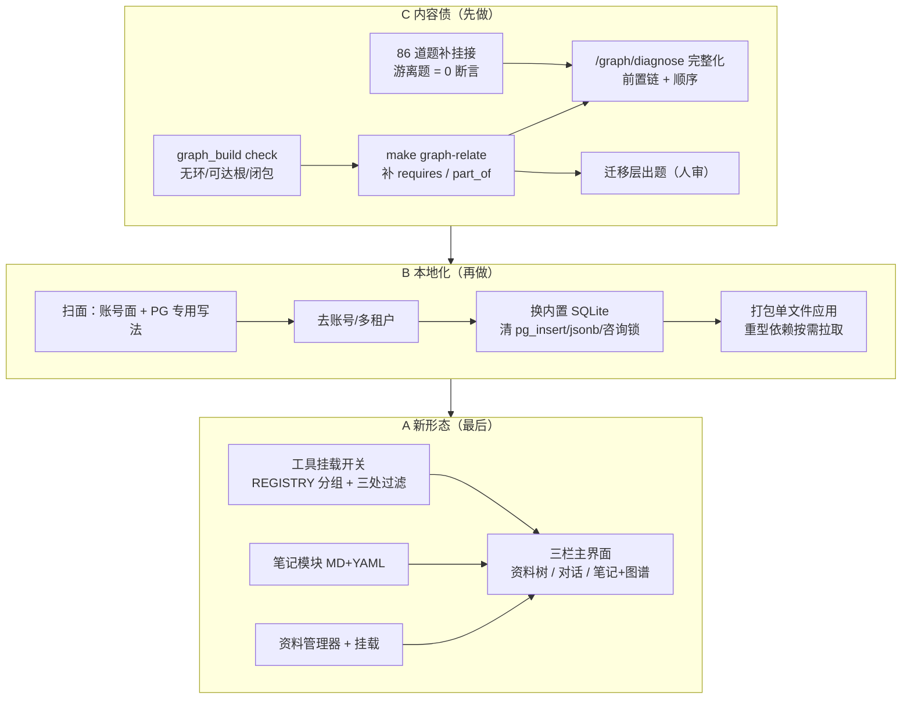

## 需求概述

依据 `draft/c.md`（方向决策）与 `draft/cc.md`（内容债报告），把 QuizForge 从"刷题 + 到期复习"推进为本地优先的认知引擎。用户在问答中确定的硬约束：

- **三块都做，顺序 C → B → A**：C 内容债（让它真的会教）→ B 本地化与分发（去账号/多租户、去 Docker、打包 exe）→ A 前端新形态（三栏 + 笔记模块 + 挂载式工具开关）。
- **数据形态**：`MD + YAML` 只用于**新模块**（笔记 / 大纲 / 资料索引）；题库、掌握度、记录仍以数据库为权威，现状不动。
- **账号**：这一版就去掉 —— 单用户本地，登录页 / 注册 / 会话 / 按用户过滤全清，启动即可用。
- **沙箱 Python 提速**：先不动。

## 核心功能

**C · 让它真的会教**

- 图谱体检可执行化：无环、任一概念可达根、无自环与双向语义边、传递闭包不矛盾
- 补有序边（`requires` / `part_of`）：从当前 686 条 / 912 概念（平均 0.75 条）补到"路径推荐不会断在半路"
- 86 道未挂概念的题补挂接，并把"游离题 = 0"固化为覆盖率断言
- 根因诊断从雏形做完整：错题 → 考点 → 前置链 → 先补哪个、几步，并接到错题本页
- 迁移层出题（当前 0 道）：少而精、必须人审、必须挂概念

**B · 本地化与分发**

- 去掉注册 / 登录 / 会话 / CSRF 守卫与所有按用户过滤，双击启动即可用
- 数据库换成内置引擎（随应用分发，无需外部服务），开发与运行同一套
- 打包成单文件应用：内置本地服务与前端产物；重型依赖首启按需拉取到本地缓存
- 数据快照从"服务端导出"变成"单文件备份"，可一键备份与恢复

**A · 前端新形态**

- 三栏主界面：左资料树 / 中对话流 / 右笔记与图谱，切换不打断心流
- 笔记模块：本地文件承载，大纲 + 双链，同一份数据多种渲染；agent 可原地重构
- 资料管理器：本地文件树 + 挂载到当前对话，资料只读、与笔记物理隔离
- 挂载式工具开关：顶栏几个图标控制 AI 能调用哪些模块，亮起即调用，熄灭即独立；极简模式 = 不挂任何工具，体验等同普通聊天

**视觉**：延续现有苹果式克制风格与既有设计令牌，不新造配色；三栏节奏靠留白与分隔，图标为细描边同源图形，交互动作跟手、无多余弹层。

## 一、总体策略

三段各自独立可验证，**每一段收尾都必须让门禁变绿或保持绿**（`make test` 3170 断言 + `node --check` 语法门禁、`make api-test` 183 项），并且每段都有可复现的对账口径，而不是"看起来对"。



## 二、C 段：内容债

- **先体检后补边**：给 `pipeline/graph_build.py` 加 `check` 子命令，把 cc.md 的验收条件变成可执行断言（无环、任一概念可达根、无自环、无双向语义边、传递闭包不矛盾），并把结果并入现有 `stats`。已有 `stats()` 里"自环与双向语义边""归并把握度低"等项作为基础。
- **补有序边**：判边能力已存在（`relate_pairs(limit, min_weight)`，只喂 `weight >= min_weight` 的 `co_occurs` 对，写入带 `why` 的类型边），本段的工作是**批量推进**：按 `weight` 分档、按主题分批、幂等可续跑，每批之后跑一次 `check`，直到"每个概念都能走到根"；顺序边只认 `derived_by='llm'` 或人工确认过的，机械派生的 `contrast_with` 不参与路径计算（cc.md 已指出它精度偏松）。
- **题-概念挂接**：事实层是 `question_points`，统计口径是 `question_concepts`（表注释写明"点保留证据，概念上做统计"）。86 道游离题优先用确定性派生补（题上已有的 `topic`/`pointKey` → 点 → 概念），剩下的带出处让模型判一次；补完在 `pipeline/coverage.py` 里加一条硬断言"游离题 = 0"。
- **路径与诊断**：`/graph/diagnose` 已存在但只是雏形，补成"考点 + 前置链 + 建议顺序 + 步数"，并接进错题本页（这是 `docs/经验-2026-09-16-图谱化改造.md` 里点名的下一步）。查询用 SQL 递归 CTE 或应用层 BFS + 缓存即可 —— 912 概念规模不需要图数据库，延续既有取舍。
- **迁移层出题**：走既有流水线与 `quizforge-l4-transfer` 规程，人写/人审的手写题走 `quizforge-handmade`；产出必须挂概念、必须带分支点、必须点名请用户过目。

## 三、B 段：本地化与分发

- **扫面先行**：账号面的宽度靠一次性扫描定，不靠猜 —— `routers/auth.py` + `deps.py`（`CurrentUser` / `AuthenticatedWriter` / `WriteGuard` / CSRF）+ 每个路由里的 `user_id` 过滤 + `models.py` 里带归属列的表（`users` / `sessions` / `user_settings` / `user_questions` / `conversations` 等）+ 前端 `landing.html` / `login.html` / `boot.js` 的登录跳转。
- **去账号**：删守卫与逐用户过滤，改为单用户上下文；`user_settings` 退化成一张单行设置表（挂载开关等设置仍然要落盘，因此保留表结构、只去掉归属语义）。前端去掉登录页与跳转，启动直进。
- **换内置引擎**：模型层已经为可移植做了准备（`JSONType = JSON().with_variant(JSONB(), "postgresql")`、`db.py` 按方言建引擎、`config.is_postgres` 已存在），**边界就是这几处 Postgres 专用写法**：

1. `pipeline/dbstore.py` 里编号分配用的 `pg_advisory_xact_lock` → 换成 `BEGIN IMMEDIATE` 事务 + 唯一索引重试
2. `api/app/sync_ops.py` 的 `pg_insert`（ON CONFLICT）与"JSONB 按路径原子自增"→ 换成读改写 + 行级锁（单用户，竞争面极小）
3. `api/app/outline.py` 的原生 SQL（`CAST(... AS JSONB)`、`path @> ...` 包含查询）→ 换成 JSON 列的应用层过滤
4. `api/app/ai_gateway.py` 的 `pg_insert`

- **数据搬运**：写一次性 PG → 新库的搬运与对账脚本（表行数 + 关键计数如已发布题数、概念数、边数必须逐项对上），随后 `make db-dump` / `db-restore` 改成单文件快照；`docker-compose.yml` 与 `db-up` / `docker-up` 系列目标退役。
- **打包分发**：单文件应用（内置本地服务 + 前端产物 + 运行时数据目录），双击即用；重型依赖（pyodide 与预置包）**不进安装包**，首启按需拉取到本地缓存并校验哈希 —— 这是对 c.md 第 17/18 条张力的显式取舍：**仓库里自包含**（开发与离线开发可用），**分发包保持小体积**（首次联网拉一次，之后本地可用）。
- 明确一句结论：去账号把"多用户"这条缝封上；`vendor/` 已全部入库，开发环境不依赖外网。

## 四、A 段：新形态

- **工具挂载（最小改动面）**：`api/app/tools.py` 的 `REGISTRY`（dict，含 `fn` / `description` / `parameters`）加一层"分组"标记（资料 / 笔记 / 出题 / 图谱 / 沙箱），然后在三处按挂载集过滤：`specs()`（只声明已挂载的）、`call()`（未挂载直接返回 `{"error": ...}`，纵深防御）、`agent_loop.run(tools=...)` 的调用点。**空集就是极简模式** —— 模型拿不到任何工具，等同普通聊天，这是 c.md 第 11 条最省事的落点。
- **笔记与资料（新模块用 MD+YAML）**：落盘目录按应用数据目录组织（`notes/` 与 `library/` 物理隔离）；笔记 = 一文件一主题、YAML 头 + 正文、`[[双链]]` 与大纲同一份数据不同渲染；资料 = 只读、被索引、可选挂载进当前对话（挂载是"这次对话优先检索它"，不是复制内容）。
- **页面与导航**：把 chat 页升格为三栏主界面（它是 c.md 第 6 条说的唯一调度枢纽），右侧栏承载笔记与图谱两种视图并可切换（图谱复用现有 `graph.js`）；答题与错题本继续作为专门视图保留。章节树（结构）与概念图（连接）在 UI 上独立切换，不强行融合。
- **边界**：前端继续原生 HTML/CSS/JS 不引框架；库一律 `vendor/` 自包含，不走 CDN。

## 五、性能与可靠性

- C 段的判边是唯一有对外花销的部分：按 `weight` 分档 + 按批推进 + 幂等可续（失败批次重跑不重复写），逐批体检，避免"跑一大批才发现半路出环"。
- 图查询（前置链）在 912 概念规模下用一次 BFS/递归 CTE + 请求内缓存即可；不做图库、不做向量库，延续既有取舍。
- B 段的换库是最大的一次性风险：搬运脚本必须双向可核对（行数 + 关键计数），并在切换前保留旧库快照；打包后要能"从零启动一次"（无库、无缓存）跑通。
- 可靠性红线：`make test` 与 `make api-test` 全程保持绿；UI 改动必须有浏览器实测数值或截图证据（本仓库惯例）。

## 六、目录与文件（要点）

```
pipeline/
  graph_build.py        [MODIFY] 加 check（无环/可达根/闭包）并入 stats；relate 批量推进参数
  coverage.py           [MODIFY] 加"游离题 = 0"断言；概念口径对账
  dbstore.py            [MODIFY] 编号分配去 pg_advisory_xact_lock
  dbdump.py / migrate   [NEW]    PG → 新库搬运 + 对账
api/app/
  models.py             [MODIFY] 去归属语义（users/sessions 退役，user_settings 降为单行设置）
  deps.py               [MODIFY] 删 CurrentUser / AuthenticatedWriter / CSRF 守卫
  routers/auth.py       [DELETE] 注册/登录/退出/改密
  routers/*.py          [MODIFY] 逐处去掉 user_id 过滤；chat 加挂载集读取
  sync_ops.py           [MODIFY] 去 pg_insert 与 JSONB 原子自增
  outline.py            [MODIFY] 去 jsonb 原生 SQL
  ai_gateway.py         [MODIFY] 去 pg_insert
  tools.py              [MODIFY] REGISTRY 分组；specs()/call() 按挂载集过滤
  agent_loop.py         [MODIFY] 只声明已挂载工具
  notes.py / library.py [NEW]    笔记与资料（MD+YAML、索引、挂载）
theme/
  pages/study.body.html [NEW]    三栏主界面（或由 chat 页升格）
  runtime/notes.js      [NEW]    笔记：大纲/双链/渲染
  runtime/library.js    [NEW]    资料树与挂载
  runtime/chat.js       [MODIFY] 顶栏枢纽图标、挂载开关、右栏切换
  login.html / landing.html [DELETE] 登录与着陆
build/
  package.py            [NEW]    单文件打包 + 首启按需拉取与哈希校验
docs/
  STATUS.md             [MODIFY] 改准（cc.md 点名过时）
```

## 七、执行注意（防回归）

- 题库/掌握度/记录始终以数据库为权威，C 段的挂接与判边都要写库、可对账、可复现。
- 出题流水线的状态机（`draft → verified → published`，退役只下架不删除）与覆盖率口径不得破坏；复用既有 `make drive` 与 skill 规程。
- 提交信息用中文且要短，一次提交一件事；改完题库必须 `python3 tools/check.py` 到 0 error。
- 上一版遗留的小账顺手带上：卡片来源标记、用一道用户题跑通"作答 → 判分 → 记录"、组卷页题源在浏览器验一次、`test_tools.py` 里两条 `push_question` 用例时好时坏。

## 设计定位

延续既有的苹果式克制风格：**结构性信息靠留白与分隔，不靠色块与阴影堆叠**。本版新增的是"三栏工作台"，它必须看起来像一件工具而不是一个网站 —— 没有装饰性图形、没有多余弹层、图标同源同粗细。

## 主界面：三栏工作台

- **顶栏**：左侧品牌图标（回首页，与 `shell.html` 现有那枚同源），中部枢纽图标组（资料 / 笔记 / 出题 / 图谱），亮起即挂载、熄灭即独立；右侧设置与主题。图标为细描边、统一笔画粗细与视觉重量。
- **左栏 · 资料树**：极简文件树，层级用缩进与`--fg2` 的明度差表示；选中即预览摘要，一键"挂载到当前对话"（挂载后条目上出现一个细标记，不改变行高）。资料只读，界面不提供编辑入口。
- **中栏 · 对话流**：沿用现有消息区（零件化渲染：正文、过程折叠、题卡、引用、演示、执行）；消息间距与卡片同源 elevation；过程块默认折叠为一行，展开不改变其它消息位置。
- **右栏 · 笔记 / 图谱**：顶部一个两态切换（结构 / 连接）—— 结构是笔记大纲与双链列表，连接是现有力导向图；切换不重排中栏，图谱缩放与网格跟随（沿用已修好的实现）。

## 笔记模块

- 一文件一主题，顶部 YAML 头（标题、类型、标签），正文即 Markdown + `[[双链]]`。
- 大纲视图：层级缩进 + 折叠箭头，行内可编辑（原地改，不弹窗）；双链视图：反向链接列表（"谁引用了我"）与未解析链接的提示。
- 由 agent 改动时，落点用**行内插入/替换**而不是整篇重写，并在被改段落旁留一个细标记，可对比、可撤销。

## 交互与动效

- 挂载开关切换：图标从描边到实心 + 轻微缩放（120–160ms，`ease-out`），不弹提示条。
- 三栏切换与右栏视图切换：只有透明度与位移的短过渡，不改变布局尺寸。
- 键盘优先：`⌘/Ctrl+K` 资料与笔记搜索，`↑/↓` 在结果里移动，`Enter` 在对话与笔记之间跳转。

## 响应式

- 桌面为主：三栏等宽可拖拽（左 240 / 右 320 起），窄屏（<1180px）自动折叠为"对话 + 侧栏抽屉"，侧栏用浮层而不挤压对话宽度。

## Agent Extensions

### SubAgent

- **code-explorer**
- Purpose: B 段开工前做一次完整扫面 —— 列全账号/多租户的调用面（`routers/auth.py`、`deps.py` 的守卫、每个路由里的 `user_id` 过滤、带归属列的表、前端登录跳转）与所有 Postgres 专用写法（`pg_insert`、jsonb 原生 SQL、咨询锁）。
- Expected outcome: 一份"按文件分组的改动清单"，使去账号与换库两件事不靠猜、不漏改，并在改完后作为核对表使用。

### Skill

- **quizforge-pipeline**
- Purpose: C 段补有序边与补题挂接都走既有流水线规程（`make graph-relate`、`make drive`、覆盖率对账、失败题归宿），不另起一套。
- Expected outcome: 分批判边与挂接可幂等续跑，覆盖率与"游离题 = 0"有可复现的对账输出。
- **quizforge-l4-transfer**
- Purpose: 出迁移层题（当前 0 道），按该层判定表与"迁移锚点 + 变式手法"的强制要求产出。
- Expected outcome: 一批通过该层判定表、带分支点、挂上概念的迁移层题，并明确标出需人审的部分。
- **quizforge-handmade**
- Purpose: 用户手写的迁移层/法式大题接入题库与图谱，保证不进图谱盲区。
- Expected outcome: 手写题格式合规、元数据补全、可解析出关系边、入库并参与覆盖对账。
- **playwright-cli**
- Purpose: A 段三栏界面、笔记模块与挂载开关的逐条浏览器实测（量数值、截图对比），沿用本仓库"UI 改动必须有实测证据"的惯例。
- Expected outcome: 每处 UI 改动都有改动前后的实测数值或截图，不留"看起来对"的改动。