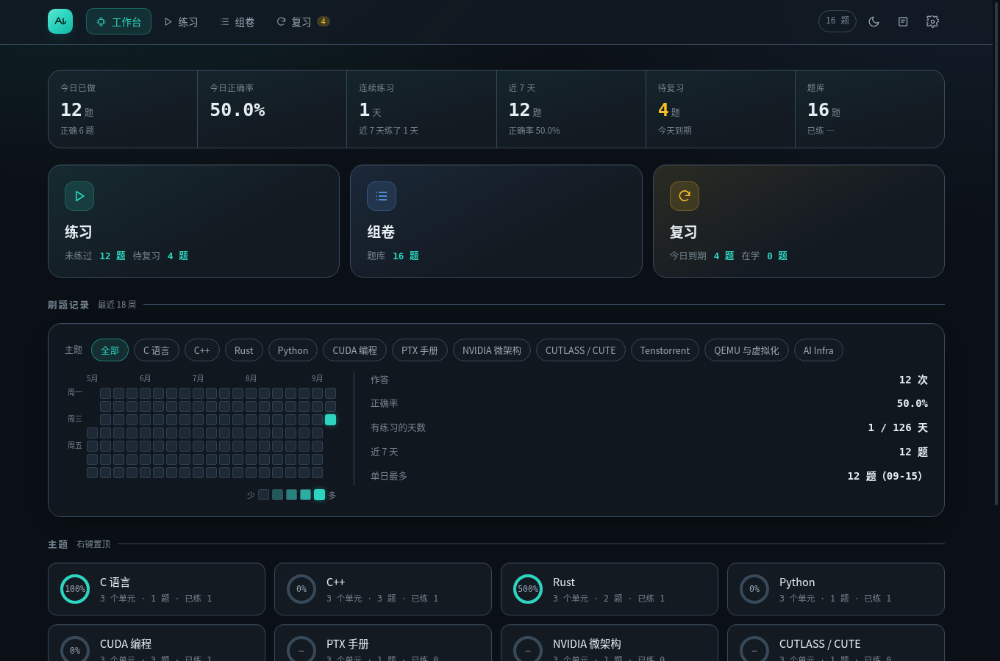
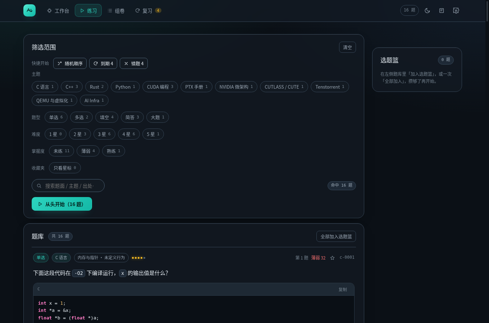

# quizforge

刷题工具。题目用 Markdown 写，支持**单选 / 多选 / 填空 / 简答 / 大题**五种题型，
题面里可以混排 LaTeX 公式与带高亮的代码块。

进度按账号存在服务端，手机和电脑接着刷同一份；也可以导出成**单个 HTML 文件**，
双击打开、断网照刷。



> **接手这个项目？** 先读两处，再动手：
>
> 1. `.codebuddy/skills/quizforge-init/SKILL.md` —— 目录地图、不可违反的铁律、任务→skill 路由表（人和 agent 都适用）
> 2. `docs/STATUS.md` —— 当前进展、未决事项、待建工具（**唯一易变的状态落点**，开工先读、收工更新）
>
> 出题规则也在 `.codebuddy/skills/`：`quizforge-author` 是格式契约，四个层 skill
> 负责「这题算不算这一层」；从材料批量出题的流程见 `references/pipeline.md`。

---

## 目录

- [快速开始](#快速开始)
- [怎么用](#怎么用)
  - [工作台](#工作台) · [练习](#练习) · [组卷](#组卷) · [复习](#复习) · [错题本](#错题本)
  - [快捷键](#快捷键) · [掌握度](#掌握度)
- [出题](#出题)
- [AI 批改](#ai-批改)
- [部署](#部署)
- [常见问题](#常见问题)

---

## 快速开始

### 在线版（推荐）

需要 Docker。三条命令：

```bash
git clone <仓库地址> && cd quizforge

cp .env.example .env          # 按需改端口；AI 密钥不在这里填，见下文
docker compose up -d --build  # 起 PostgreSQL + 后端

# 把 questions/*.md 导入数据库（幂等，改了题就再跑一次）
docker compose exec api python -m app.cli.import_bank
```

打开 **http://127.0.0.1:8100/** → 注册账号 → 开始刷题。

改完题目只要重新导入，不用重建镜像；改完前端跑 `make web`，刷新就生效。

### 离线版（单文件）

```bash
make vendor    # 首次：同步 KaTeX（从本机副本拷贝，不联网）
make build     # 生成 dist/{index,quiz,wrongbook}.html
```

双击 `dist/quiz.html` 即可。部分浏览器对 `file://` 限制 localStorage，
需要完整功能时用 `make serve PORT=8080`。

> 两种形态共用同一套界面与判分逻辑，区别只在**数据从哪来、往哪存**：
> 在线版走接口 + PostgreSQL 按账号隔离，离线版内联题库 + 浏览器本地存储。

---

## 怎么用

### 工作台

今日战况（已做 / 正确率 / 连续天数）、**刷题热力图**、主题卡片。

热力图走 GitHub 的形态：周为列、左侧标周一/周三/周五、五档配色，顶部可按主题筛选
（筛选后右侧统计数字一起变）。主题卡片右键可置顶。

### 练习

分成**选题**与**做题**两个互斥的状态：

**选题态** —— 左栏是筛选条件 + 完整题目卡片，一题一张卡，题面、选项、答案都能当场看完。
每张卡上有三个动作：`显示答案`（按需渲染解析）、`加入选题篮`、`单题练习`。
右栏是**选题篮**，攒够了点「开始练习」。



筛选项包括主题树（学科 → 单元 → 知识点，逐级展开）、题型、难度、**掌握度**、
**收藏夹**与关键词。

**做题态** —— 只有题目卡片与右侧题号列表，不再有筛选控件，底部出现答题状态栏。
逐题作答即时判分并展开解析。

### 组卷

按主题抽题、设定题量与时限，计时作答，交卷后给出总分、分主题正确率、用时与需复盘清单。
试卷草稿实时落盘，中途退出可以从「组卷」页继续。

### 复习

基于 **SM2 间隔重复**：四档自评（重来 / 困难 / 一般 / 简单）更新下次复习时间，
并给出未来 14 天的复习负载图。到期的题会出现在「复习」页与工作台的入口角标上。

### 错题本

独立页面，汇总所有答错或**答得不完整**的题（多选漏选、填空只对一部分、
AI 判为部分正确都会进来）。支持按主题筛选、原地重做、一键重刷、导出 Markdown、打印。
最近一次作答正确后自动移出默认列表，可切换「含已订正」查看。

### 快捷键

| 键 | 作用 |
|---|---|
| `1`–`9` | 选择选项 |
| `Enter` | 提交 / 下一题 |
| `←` `→` | 上一题 / 下一题 |

### 掌握度

每道题有一个 **0–100 的掌握度**，由做题记录算出，比「错没错」更能说明问题：
做对会升、长时间不碰会回落，所以能回答「哪些真的拿下了、哪些只是蒙对过一次」。

```
acc   = (correct + 1) / (attempts + 2)      平滑后的正确率
ev    = attempts / (attempts + 3)           证据强度：做得少就向中间收缩
fresh = 0.5 ^ (days / 30)                   30 天半衰期的记忆新鲜度
base  = acc × (0.55 + 0.45 × fresh) × (0.6 + 0.4 × ev)
加成   = min(streak, 3) × 3                  连续答对最多 +9
```

| 情形 | 掌握度 | 档位 |
|---|---|---|
| 从未作答 | 0 | 未练 |
| 1 次答对 | 47 | 一般 |
| 3 次全对 | 73 | 熟练 |
| 5 次全对 | 82 | 熟练 |
| 5 次全对但 60 天没碰 | 57 | 一般 |
| 1 次答错 | 23 | 薄弱 |

档位五档：`未练 < 40 薄弱 40–69 一般 70–89 熟练 ≥90 精通`，练习页可按档位筛选。

**星标**是另一回事：掌握度是算出来的，星标是手动置的。题目卡片右上角可标星，
筛选区有「只看星标」。

---

## 出题

题目就是 Markdown 文件，放在 `questions/<学科>/<id>-<描述>.md`。

### 交给 agent 出题（推荐）

仓库自带一套出题 skill（实体在 `.codebuddy/skills/`，**跟着仓库走**）：

| skill | 出什么 |
|---|---|
| `quizforge-author` | 题目**格式契约**（字段、五种题型的正文小节、校验命令） |
| `quizforge-l1-memorize` | **识记**层：术语、定义、数值、枚举的准确回忆 |
| `quizforge-l2-understand` | **理解**层：判断对错、解释机制、给新情形归类 |
| `quizforge-l3-apply` | **应用**层：按已知规程算出确定结果 |
| `quizforge-l4-transfer` | **迁移**层：换情境、换问法、跨知识点综合 |

出题时说清**层**，agent 就会走到对应的那个 skill：

> 用 CUTLASS 文档出一道**应用**层的题，考 layout 的 complement

每个层 skill 的重头戏是「怎么判断这题是不是真的在这一层」——
判定标准表 + 明确的滑坡警告（例如「只把 $64$ 换成 $128$」是假迁移）。

四层四翼（`layer` / `wing`）写在题目 front-matter 里但**不进界面**，
理由见 [`.codebuddy/skills/README.md`](.codebuddy/skills/README.md)。

如果工作区根不是本仓库，跑一次注册：

```bash
make skills-link                 # 默认链到仓库上一级
make skills-link WORKSPACE=~     # 或指定别的工作区根
```

### 手工出题

```bash
python3 tools/new_question.py --topic cpp-stl-iterator --type single --title 迭代器失效规则
python3 tools/check.py questions/cpp/cpp-0004-*.md   # 单文件快速自检
python3 tools/check.py                              # 全库校验，必须 0 error
```

### 五种题型

| type | 形态 | 判分 |
|---|---|---|
| `single` | 单选，点击选项即判 | 自动 |
| `multi` | 多选，漏选给部分分，选错判错 | 自动 |
| `blank` | 填空，支持多答案别名、正则、**代码填空**（`blankMode: code`） | 自动 |
| `short` | 简答，参考答案 + 评分要点 | AI / 自评 |
| `problem` | **大题**，多个小问逐问作答与批改 | AI / 自评 |

### 题目格式

```markdown
---
id: cpp-0001
type: single
topic: cpp-stl-iterator
difficulty: 2
source: "Effective STL Item 9"
---

题面 Markdown，可混排行内公式 $O(n\log n)$ 与代码块。

## 选项
- A. 第一个选项
- B. 第二个选项

## 答案
B

## 解析
解析正文，支持公式与代码。
```

- `topic` 取 `meta/topics.yaml` 里**任意一层**的 key（见下文）。
- 文件与 `id` 一律按**一级学科**组织（`questions/cpp/`、`cpp-0001`）。
- 正文小节名固定为：`提示` `选项` `答案` `参考答案` `评分要点` `小问` `解析`。
- 行内公式必须在同一行闭合；跨行请用块级 `$$...$$`。

大题的写法（小问用 `###`，问内用 `####` 分块）：

```markdown
## 小问

### 第 1 问｜小问标题
小问题干（可含公式、代码、表格）。

#### 参考答案
这一问的完整解答。

#### 评分要点
- 可判定是否命中的要点一
- 要点二
```

可对照两道示例：`questions/cuda/cuda-0003-gemm-roofline-problem.md`（6 小问大题）、
`questions/cpp/cpp-0003-code-blank-rule-of-five.md`（代码填空）。

### 考纲主题树

`meta/topics.yaml` 是考纲的唯一事实来源，三级结构：

| 层级 | 类比 | 用在哪 |
|---|---|---|
| 主题（depth 1） | 学科 | 工作台卡片与进度环、练习页一级筛选 |
| 单元（depth 2） | 章 | 练习页二级筛选 |
| 知识点（depth 3） | 考点 | 练习页三级筛选，**题目优先挂这一层** |

```yaml
- key: cpp
  name: C++
  group: lang          # 分组，用于工作台分栏
  color: "#5EEAD4"     # 学科色，子级自动继承
  children:
    - key: cpp-stl
      name: STL 容器与迭代器
      children:
        - key: cpp-stl-iterator
          name: 迭代器失效
```

父节点的题数包含子孙；按上层筛选会自动包含其下所有知识点。

---

## AI 批改

简答题与大题的每个小问都可以交给 AI 批改，返回得分、命中要点、遗漏要点与讲评。
返回格式异常时**自动降级**为「显示参考答案 + 自评打分」，不会卡住刷题。

### 配置

每个用户填**自己的**密钥：右上角 ⚙ → **AI 批改** → 填接口地址、模型名与密钥。

| 字段 | 示例 |
|---|---|
| 接口地址 | `https://api.deepseek.com/v1`、`https://api.openai.com/v1` |
| 模型名 | `deepseek-chat`、`gpt-4o-mini` |
| 密钥 | 你自己的密钥 |

点「测试连接」可以确认地址与密钥是否可用。

在线版会把密钥存在**你自己的账号**里：换设备不用重填，用量也记在你自己的账上。
服务端只做转发（不少供应商不允许浏览器直连），**不为任何人提供共享密钥**。

### 用本地模型

不想用云服务的话可以接 Ollama：

```bash
OLLAMA_ORIGINS=* ollama serve     # 接口地址填 http://localhost:11434/v1
```

---

## 部署

### 在线版

```bash
cp .env.example .env
docker compose up -d --build
docker compose exec api python -m app.cli.import_bank
```

| 变量（写在 `.env`） | 说明 |
|---|---|
| `API_PORT` | 宿主端口，默认 `8100` |
| `QF_COOKIE_SECURE` | 上了 HTTPS 之后改成 `true` |
| `QF_AI_ENABLED` | 实例级 AI 总开关，设 `false` 后所有人都用不了 |
| `QF_AI_DAILY_QUOTA` | **每人**每日调用上限，`0` 表示不限 |
| `QF_AI_TIMEOUT_MS` | 超时上限（毫秒） |

导入器支持预演，改题前可以先看影响面：

```bash
docker compose exec api python -m app.cli.import_bank --dry-run     # 只报告不写库
docker compose exec api python -m app.cli.import_bank --check-only  # 只校验，不连数据库
```

源里删掉的题目只会标记退役、**不会物理删除**，历史做题记录不受影响。

### 备份

数据在 PostgreSQL 的数据卷里：

```bash
make db-backup      # 导出到 ~/quizforge-backups/quizforge-<时间戳>.sql.gz
```

### 离线版

```bash
make build          # → dist/，纯静态，任意静态托管都能用
```

`dist/` 不含任何密钥，可以直接分发或上传到对象存储 / Nginx / CDN。

### 本机开发

| 命令 | 作用 |
|---|---|
| `make db-up` | 只起 PostgreSQL |
| `make api-venv` / `make api-migrate` | 建虚拟环境 / 建表 |
| `make api-dev` | 后端热重载（`127.0.0.1:8100`） |
| `make web` | 构建在线版前端 |
| `make api-test` | 后端测试 |
| `make test` | 题库校验 + 前端逻辑自测 |

改题目**不需要重建镜像**：`questions/` 与 `meta/` 是只读挂载，重新跑一次导入即可。

改前端需要重建镜像（`docker compose up -d --build`）—— 前端产物是在镜像内由多阶段构建
生成的，`make web` 只写到宿主的 `api/web`，不会进到已经在跑的容器里。
**本机打磨前端请用 `make api-dev`**：宿主 uvicorn 带热重载，直接读 `api/web`，
`make web` 之后刷新浏览器就生效，不必等镜像重建。

---

## 常见问题

**断网能用吗？**
用离线版（`make build` 出的单文件）可以完全断网刷题。在线版断网时仍能作答，
进度先存在本机，联网后自动补传。

**手机和电脑的进度会合并吗？**
会。作答是**增量**上送的，两台设备同一天的练习会相加而不是互相覆盖。
切回前台时会自动拉一次最新进度（做题过程中不会打断你）。

**数据存在哪？**
在线版在该账号名下（PostgreSQL）；离线版在浏览器 localStorage。
设置里可以导出/导入 JSON 备份。

**忘了密码怎么办？**
目前没有找回功能 —— 这是刻意的（未做邮箱验证）。请自行保管好密码；
数据可以用 `make db-backup` 备份。

**题目里能放图片吗？**
能写 ``，但要注意构建期**不会**把图片一起打包：

- **data URI**（``）：两种形态都能显示，真正做到单文件自包含，
  代价是题面文件会变大
- **绝对网址**（`https://…`）：需要联网
- **相对路径**：只有在用 `make serve` 之类的 HTTP 服务打开（且图片确实在那个目录下）时才行；
  直接双击 `dist/index.html` 时相对路径的图片会裂

题目相关的图片多数是公式与代码，建议优先用 LaTeX 与代码块，实在需要图片就用 data URI。

**支持哪些浏览器？**
Chrome / Edge / Safari / Firefox 的近几年版本都可以。

---

## 开发者

工程决策与取舍（为什么这样设计、哪些坑踩过）记在 [`docs/DESIGN.md`](docs/DESIGN.md)。

```bash
make help      # 列出全部命令
make test      # pytest + selftest
```
